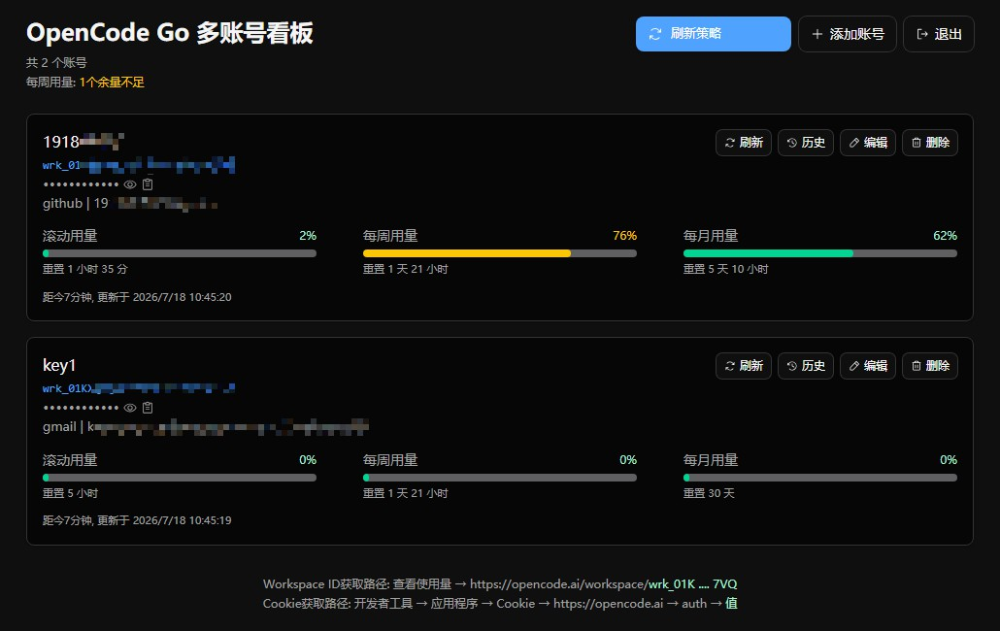
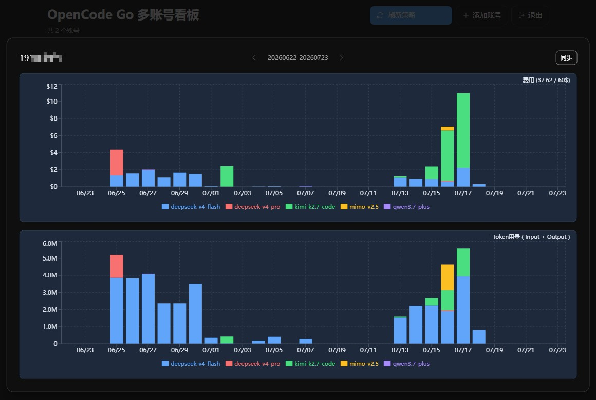

# OpenCodeBoard

自托管多账号 OpenCode Go 额度监控面板, Auth Cookie / API Key 未加密存储, 仅供个人使用。




## 功能

- 密码保护的管理后台
- 多账号增删改查
- 一键刷新单个或全部账号额度
- 双图表用量历史（费用 + Token 用量），31 天计费周期
- 用量接近上限时高亮提示
- API Key 独立存储，显示/隐藏/复制
- Express + React 全栈，SQLite 存储
- 支持 Docker 部署

## 快速开始

```bash
docker pull limxc/opencodeboard:latest
```

```yaml
services:
    app:
        image: limxc/opencodeboard:latest
        ports:
            - "3000:3000"
        environment:
            - PASSWD=123456 #修改为强密码
            - PORT=3000
        volumes:
            - ./data/sqlite:/app/data
        restart: unless-stopped
```

```bash
docker compose up -d
```

## 开发

使用 `dev.ps1` 管理开发服务器（PowerShell 5.1）：

```bash
# 前端（Vite 开发服务器 :3000）
npm run dev -- --port 3000

# 后端（热重载 :3001）
set PORT=3001 && npm run dev:server
```

## 配置（.env）

| 变量     | 说明                    |
| -------- | ----------------------- |
| `PASSWD` | 管理后台登录密码        |
| `PORT`   | 服务器端口（默认 3000） |

## 获取 Auth Cookie & Workspace ID

1. 登录 [opencode.ai](https://opencode.ai)
2. Cookie获取路径: 开发者工具 → 应用程序 → Cookie → https://opencode.ai → auth → 值
3. Workspace ID获取路径: 查看使用量 → https://opencode.ai/workspace/wrk_xxx → wrk_xxx

## 项目结构

```
├── src/
│   ├── client/               # React 前端（Vite）
│   │   ├── components/       # UI 组件
│   │   │   ├── AccountDialog.tsx    # 账号表单弹窗
│   │   │   ├── AccountTable.tsx     # 账号列表（卡片）
│   │   │   ├── ErrorBoundary.tsx    # 错误边界
│   │   │   ├── HistoryDialog.tsx    # 用量历史弹窗（双图表）
│   │   │   ├── LoginForm.tsx        # 登录页
│   │   │   ├── Toast.tsx            # Toast 通知
│   │   │   └── UsageBar.tsx         # 用量进度条
│   │   ├── lib/
│   │   │   ├── api.ts         # API 客户端（含 SSE 流式读取）
│   │   │   └── format.ts      # 工具函数
│   │   ├── app.css
│   │   ├── App.tsx            # 主应用
│   │   ├── main.tsx           # 入口
│   │   └── types.ts           # 类型定义
│   ├── server/                # Express API
│   │   ├── auth.ts            # HMAC Session 认证
│   │   ├── database.ts        # ConnectionManager 多库连接
│   │   ├── db.ts              # CRUD 操作（accounts + usage_history）
│   │   ├── index.ts           # 路由 + 迁移 + SSE 端点
│   │   ├── migrate.ts         # 独立迁移脚本
│   │   ├── quota.ts           # OpenCode 抓取（额度 + 历史）
│   │   └── types.ts           # 类型定义
├── migrations/
│   ├── accounts/              # accounts 表迁移
│   └── usage_history/         # usage_history 表迁移
├── data/                      # SQLite 数据库文件
│   └── sqlite/                # Docker volume 挂载点
├── public/
│   └── favicon.ico
├── docs/
│   └── superpowers/           # 设计文档、实施计划、验证报告
├── openspec/                  # OpenSpec 变更记录
├── dev.ps1                    # 开发服务器管理脚本
├── push-to-registry.ps1       # 构建推送脚本
├── docker-compose.yml
└── vite.config.ts
```

## 数据库架构

- `accounts.db` — 账号信息（单文件常开连接）
- `{workspace_id}.db` — 各账号用量历史（按需打开）
- 计费周期：31 天

## 许可证

MIT
